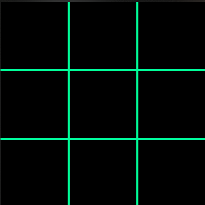
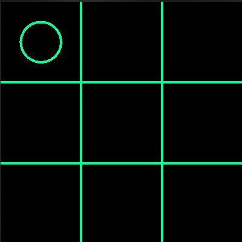

# Tic-Tac-Toe
This project has two parts.

- Playing against human.
  
  - Two players play on the same screen against each other.
  
- Playing against human.
  
  - A player plays against the AI. (Spoiler: The AI is impossible to beat. Reason explained below.)

[Wiki Link for Minimax Algorithm](https://en.wikipedia.org/wiki/Minimax)

## Demo

### Draw

### AI Wins
  |

## FAQ

#### How to run this on my System?
Since this uses python port of p5.js library, run `pip3 install p5==0.6.0` command in terminal to install p5.
Then run the program.

#### How to use it?
There are two files:

`main_board_h_vs_h.py` (Run this to play against human)

`main_board.py` (Run this to play against AI)

Click on any box in 3x3 grid to select that position for player marker and make the move.

#### How is first player chosen?
It is chosen randomly.

#### Why is the AI unbeatable?

As in the implementation of minimax algorithm, the program looks through every move in the grid recursively and chooses the best move. So only two outcomes are possible, either the AI wins or a draw.

While going through every move, the program expects the user to make the most optimal move.
